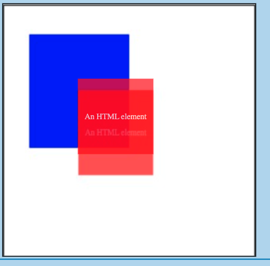

## Repro for [Playwright canvas bug](https://github.com/microsoft/playwright/pull/32248#issuecomment-2465461548)

### How to run

```bash
npm install
npm run serve
```

In another terminal
```bash
npm run playwright
```

Visit the page at [http://localhost:1234/](http://localhost:1234/) to see how it's supposed to look.

Run the single test and see how the trace screenshot doesn't match what the page looks like.

### Expected


### Playwright trace image



